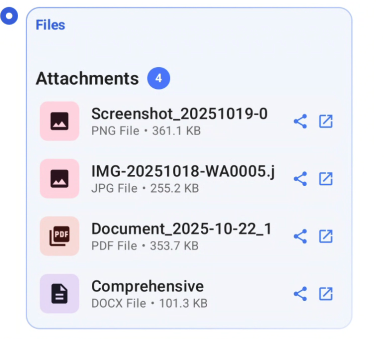
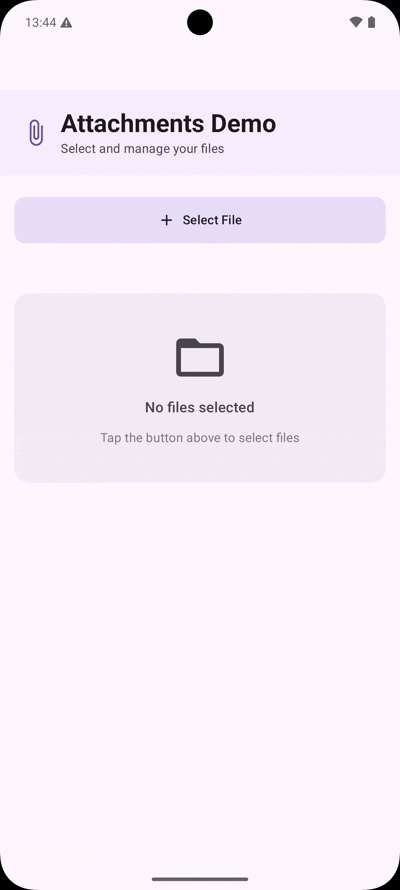

# Compose Attachments View

[](https://jitpack.io/#gaikwadchetan93/attachments-compose)
[](LICENSE)
[](https://android-arsenal.com/api?level=21)

A beautiful, Material Design 3 attachment viewer for Jetpack Compose.

## ✨ Features

- 📎 Display multiple file attachments from URIs
- 🎨 Material Design 3 theming support
- 🌓 Dark theme compatible
- 🖼️ Automatic file type detection
- 📱 Fully customizable appearance
- ⚡ Lightweight with minimal dependencies

## 📸 Screenshots

  <p align="center">
    
  </p>

## 📸 Demo

<p align="center">
  
</p>

## 📦 Installation

### Step 1: Add JitPack repository

In your **root** `settings.gradle.kts`:

  ```kotlin
  dependencyResolutionManagement {
      repositoriesMode.set(RepositoriesMode.FAIL_ON_PROJECT_REPOS)
      repositories {
          google()
          mavenCentral()
          maven { url = uri("https://jitpack.io") }
      }
  }
```
###  Step 2: Add dependency

  In your app build.gradle.kts:

  ```kotlin
  dependencies {
      implementation("com.github.gaikwadchetan93:attachments-compose:1.0.0")
  }
```

##  🚀 Usage

  ### Basic Example

  ```kotlin
  import com.github.gaikwadchetan93.attachmentscompose.AttachmentView

  @Composable
  fun MyScreen() {
      val attachmentUris = listOf(
          "content://media/external/file/1234",
          "content://media/external/file/5678",
          "https://example.com/document.pdf"
      )

      AttachmentView(
          attachments = attachmentUris,
          onAttachmentClick = { uri ->
              // Handle click - open file viewer
              openFile(uri)
          }
      )
  }

  Custom Styling

  AttachmentView(
      attachments = attachmentUris,
      modifier = Modifier
          .fillMaxWidth()
          .padding(16.dp),
      // Add any custom styling options your library supports
      onAttachmentClick = { uri -> /* ... */ }
  )

  Single Attachment

  AttachmentView(
      attachments = listOf("content://media/external/file/1234"),
      onAttachmentClick = { uri -> /* ... */ }
  )

 ```

##  📖 API Reference

  AttachmentView

  Main composable function for displaying attachments.

  | Parameter         | Type             | Required | Description                  |
  |-------------------|------------------|----------|------------------------------|
  | attachments       | List<String>     | ✅ Yes    | List of file URIs to display |
  | modifier          | Modifier         | No       | Modifier for the composable  |
  | onAttachmentClick | (String) -> Unit | No       | Click callback with URI      |

 
##  🤝 Contributing

  Contributions are welcome! Please feel free to submit a Pull Request.

##  📄 License

  Copyright 2025 Chetan Gaikwad

  Licensed under the Apache License, Version 2.0 (the "License");
  you may not use this file except in compliance with the License.
  You may obtain a copy of the License at

      http://www.apache.org/licenses/LICENSE-2.0

  Unless required by applicable law or agreed to in writing, software
  distributed under the License is distributed on an "AS IS" BASIS,
  WITHOUT WARRANTIES OR CONDITIONS OF ANY KIND, either express or implied.
  See the License for the specific language governing permissions and
  limitations under the License.

##  🌟 Show Your Support

  Give a ⭐️ if this project helped you!

##  📧 Contact

[LinkedIn](https://www.linkedin.com/in/chetan-gaikwad/)

[Check out the GitHub repository](https://github.com/gaikwadchetan93/attachments-compose)

<h1 align="center">Made with ❤️ using Jetpack Compose</h1>
